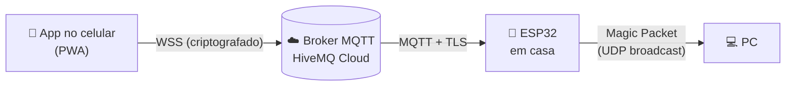

<div align="center">

# 🖥️ Meu PC, de qualquer lugar

**Ligue seu computador pelo celular, de qualquer lugar do mundo, usando um ESP32 de poucos reais.**


### 👉 [Abrir o app](https://m1vz.github.io/meu-pc-app/) 👈

*Você não precisa hospedar nada: é só abrir o link, digitar os dados do **seu** broker e pronto.*

</div>

---

## 📖 O que é isso?

Um projeto para **ligar o PC remotamente**, sem mexer na placa-mãe, sem relé e sem abrir o gabinete.

Um ESP32 fica ligado em casa, conectado ao Wi-Fi. Quando você toca no botão do app, o comando viaja pela internet até ele, e ele acorda o PC usando **Wake-on-LAN**, um recurso que já existe na maioria das placas de rede.

## ⚙️ Como funciona



1. O app publica `LIGAR` no tópico `meu-pc/comando` do broker.
2. O ESP32 está conectado ao mesmo broker (é ele que puxa a conexão, então **não precisa abrir porta no roteador**).
3. Ao receber o comando, o ESP32 dispara o Magic Packet na rede local.
4. O PC acorda e o ESP32 responde `wol_enviado`, que aparece no app.

## 🧰 O que você precisa

| Item | Observação |
| --- | --- |
| **ESP32** (DevKit com ESP32-WROOM-32) | Qualquer placa comum serve |
| **Cabo USB de dados** | Só para gravar; depois basta um carregador de celular |
| **PC com Wake-on-LAN** | De preferência ligado por **cabo Ethernet** |
| **Wi-Fi 2,4 GHz** | O ESP32 não conecta em 5 GHz |
| **Conta no HiveMQ Cloud** | O plano gratuito (Serverless) é suficiente |
| **Arduino IDE** | Com o pacote de placas *esp32* da Espressif |

## 🚀 Passo a passo

### 1. Prepare o PC para acordar pela rede

1. **BIOS/UEFI:** ative *Wake on LAN* (às vezes chamado de *Power On by PCI-E*) e **desative** *ErP/EuP*, que corta a energia da placa de rede quando o PC desliga.
2. **Windows:** no Gerenciador de Dispositivos, abra sua placa de rede → *Gerenciamento de Energia* → marque **Permitir que este dispositivo ative o computador** e **Permitir apenas um Magic Packet**.
3. Ainda na placa de rede, aba *Avançado*: ative **Wake on Magic Packet** e **Shutdown Wake-On-Lan**, se existirem.
4. Desative a **Inicialização rápida** (Painel de Controle → Opções de Energia).
5. Descubra o **MAC** da placa de rede: `ipconfig /all` → *Endereço Físico*.

> 💡 O comando de teste é desligar pelo menu **Desligar** (não hibernar) e esperar uns 10 segundos antes de tentar acordar.

### 2. Crie o broker MQTT (HiveMQ Cloud, grátis)

1. Crie a conta em [console.hivemq.cloud](https://console.hivemq.cloud) e escolha **Nuvem → Serverless (Free)**.
2. Em *Visão geral*, copie a **URL do cluster** (`xxxx.s1.eu.hivemq.cloud`).
3. Em *Gestão de Acessos*, crie **dois usuários com senhas diferentes**:
   - um para o **ESP32**
   - um para o **app/celular**

   Anote as senhas na hora: o HiveMQ só mostra uma vez.

### 3. Grave o ESP32

1. Clone este repositório.
2. Copie `esp32-pc-remote/secrets.example.h` para `esp32-pc-remote/secrets.h` e preencha Wi-Fi, host do broker, usuário/senha do ESP32 e o MAC do seu PC.
3. No Arduino IDE, instale o pacote **esp32** (Espressif) e a biblioteca **PubSubClient**.
4. Selecione a placa **ESP32 Dev Module**, escolha a porta e faça o upload.
5. Abra o Serial Monitor (115200 baud) e confira `[WiFi] Conectado!` e `[MQTT] Conectado!`.

<details>
<summary>⚠️ Deu erro <code>Wrong boot mode detected (0x13)</code> no upload?</summary>

Placas com chip **CH340** às vezes não entram sozinhas em modo de gravação. Faça assim: segure **BOOT**, aperte e solte **EN**, solte **BOOT** e rode o upload de novo. Este repositório também traz o `flash.ps1`, que grava a 115200 baud sem auto-reset (para Windows/PowerShell com arduino-cli).

</details>

Depois de gravar, **tire o ESP32 do USB do PC** e ligue-o em um carregador de celular na tomada. Se ele ficar no USB do PC, desliga junto com o PC.

### 4. Use o app

1. Abra **[m1vz.github.io/meu-pc-app](https://m1vz.github.io/meu-pc-app/)** no celular.
2. Preencha:
   - **Servidor:** a URL do seu cluster HiveMQ
   - **Usuário e senha:** do usuário **do app** (não o do ESP32)
3. Toque em **Salvar e conectar**.
4. Instale como aplicativo:
   - **Android:** menu ⋮ → *Instalar app*
   - **iPhone:** Compartilhar → *Adicionar à Tela de Início*

🔒 **Seus dados ficam só no seu aparelho.** O app roda inteiro no navegador e conversa direto com o *seu* broker. Não existe servidor intermediário, então quem hospeda o link nunca vê seu host, usuário ou senha.

## 📡 Tópicos MQTT

| Tópico | Direção | Conteúdo |
| --- | --- | --- |
| `meu-pc/comando` | app → ESP32 | `LIGAR` ou `STATUS` (QoS 1, **sem retain**) |
| `meu-pc/status` | ESP32 → app | `online` / `offline` (retido; o `offline` vem do Last Will se o ESP32 cair) |
| `meu-pc/resposta` | ESP32 → app | JSON, ex.: `{"comando":"LIGAR","resultado":"wol_enviado"}` |

Resultados possíveis: `wol_enviado`, `falha` (sem Wi-Fi), `ignorado` (LIGAR repetido em menos de 5 s), `online` (resposta ao STATUS) e `desconhecido`.

## 💡 Indicadores da placa

- **LED azul aceso:** Wi-Fi conectado
- **3 piscadas rápidas:** Magic Packet enviado
- **1 piscada longa:** falha (sem Wi-Fi)
- **Botão BOOT:** funciona como atalho de LIGAR, sem precisar do app

## 🛠️ Solução de problemas

| Sintoma | Provável causa |
| --- | --- |
| `[MQTT] Falhou, estado -2` | Host ou porta errados, ou problema de rede/TLS |
| `[MQTT] Falhou, estado 4` ou `5` | Usuário ou senha do ESP32 recusados |
| App diz "usuário ou senha recusados" | Você usou o usuário do ESP32 no app, ou a senha está errada |
| Pacote enviado, mas o PC não liga | Wake-on-LAN não está ativo na BIOS/Windows, ou o *ErP/EuP* está ligado. Confira se o LED da porta Ethernet continua aceso com o PC desligado |
| ESP32 não conecta no Wi-Fi | A rede precisa ser 2,4 GHz |
| Botão LIGAR desabilitado no app | O ESP32 está offline |

## 🔐 Segurança

- **Nunca publique `LIGAR` com a opção *retain*.** O broker guardaria a mensagem e o PC ligaria toda vez que o ESP32 reconectasse.
- Use **senhas diferentes** para o usuário do ESP32 e o do app.
- A conexão com o broker é sempre **criptografada (TLS)**, e o ESP32 valida o certificado do servidor.
- O arquivo `secrets.h` está no `.gitignore` e **não deve ser enviado ao GitHub**.

## 📁 Estrutura do repositório

```
esp32-pc-remote/
├── esp32-pc-remote.ino    firmware do ESP32
├── ca_cert.h              certificados raiz para validar o TLS do broker
└── secrets.example.h      modelo de configuração (copie para secrets.h)

flash.ps1                  compila e grava (Windows/PowerShell)
monitor.ps1                lê a Serial e envia comandos
mqtt-test.ps1              testa o broker pelo PC (escuta e envia comandos)
```

## 🗺️ Como o projeto foi construído

- [x] **Fase 1:** setup do ESP32 e primeiro upload
- [x] **Fase 2:** conexão Wi-Fi com reconexão automática
- [x] **Fase 3:** Wake-on-LAN local, testado com o PC desligado
- [x] **Fase 4:** MQTT com TLS no HiveMQ Cloud
- [x] **Fase 5:** app web (PWA) instalável no celular
- [ ] **Próximos passos:** revisão final de segurança e detecção do estado real do PC (ligado/desligado)

---

<div align="center">

Feito com 🔌 por [@m1vz](https://github.com/m1vz)

</div>
